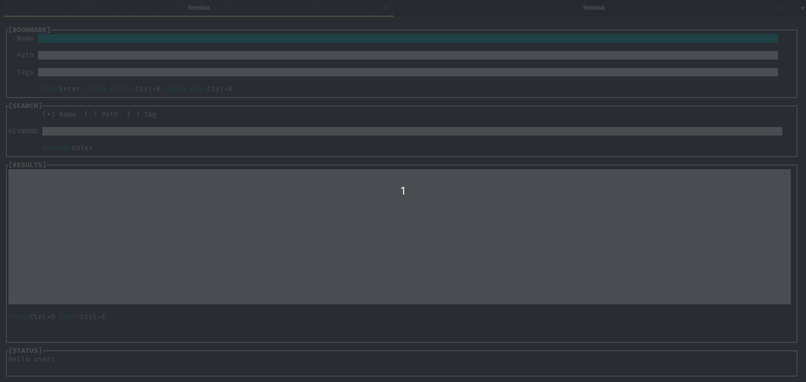

# bookmarkscli
A bookmark manager tool for the command line

This tool allows to create, search, edit and delete bookmarks. In incomming weeks I will add options to open the bookmark with your favorite web browser and also I will add the delete option (forgot to do that :S).

To change the theme edit the file inide the themese folder.

